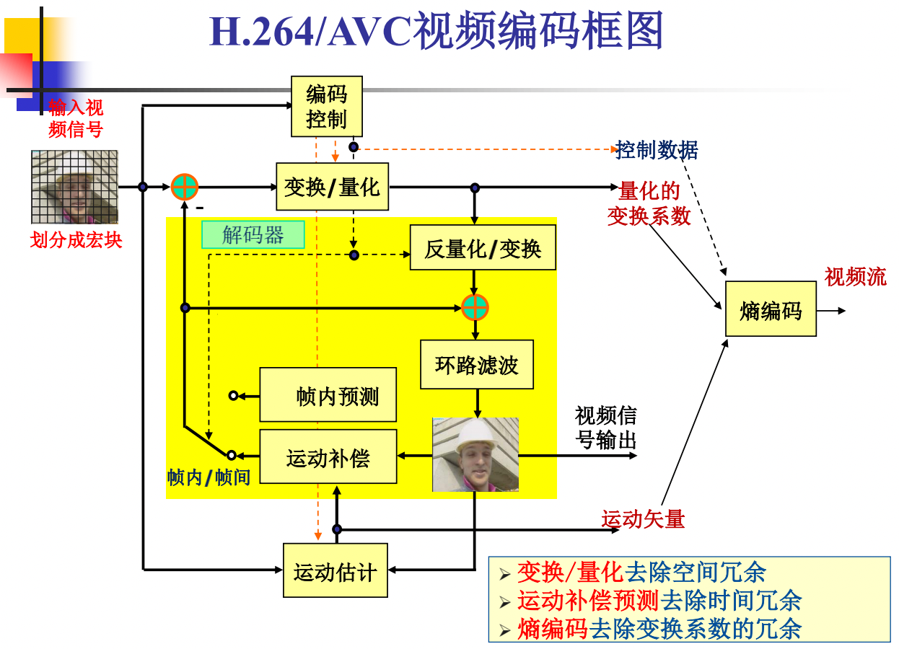
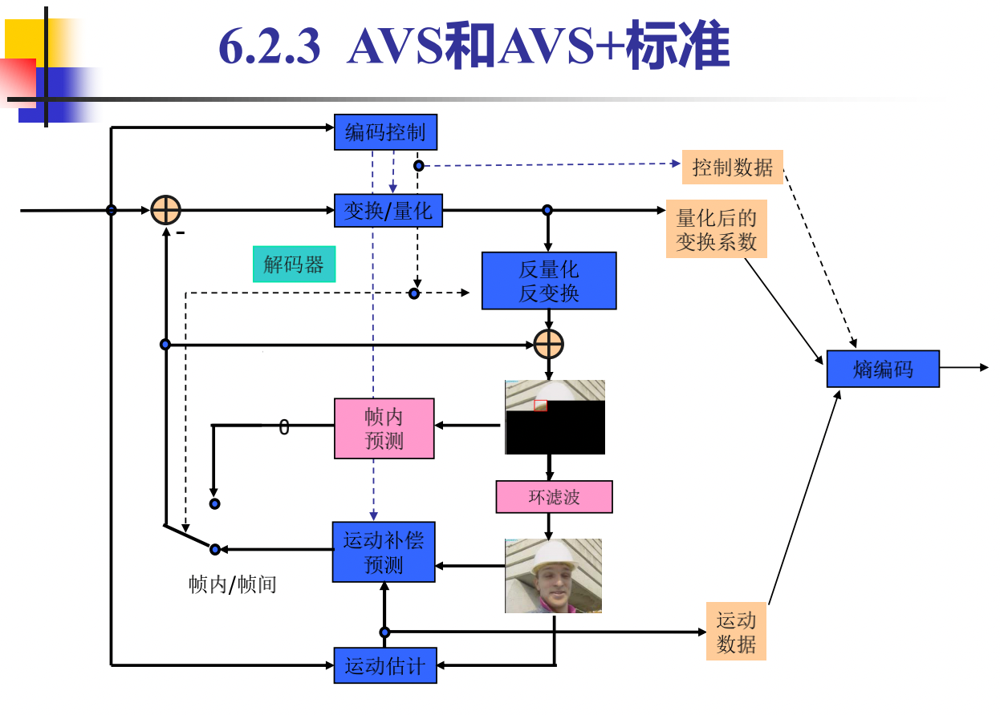
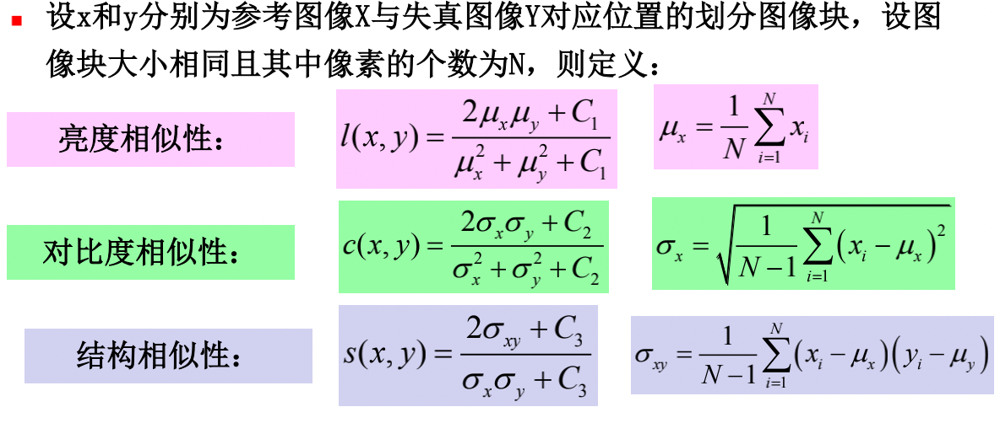
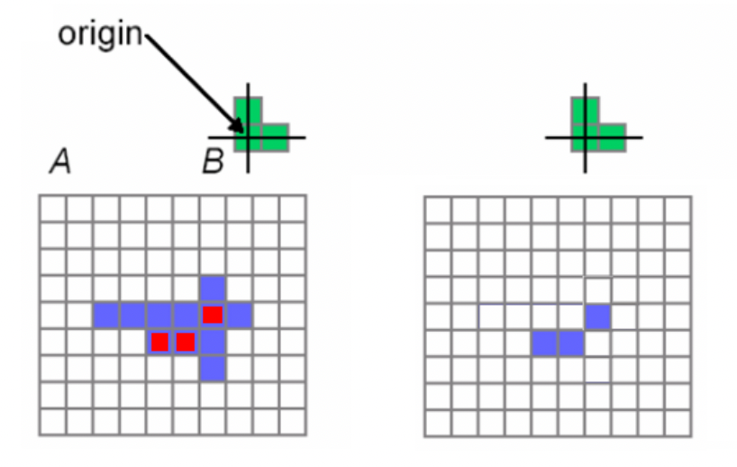
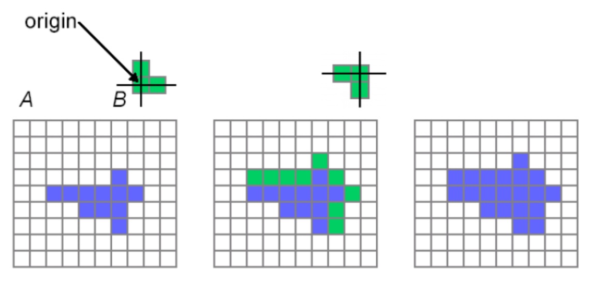
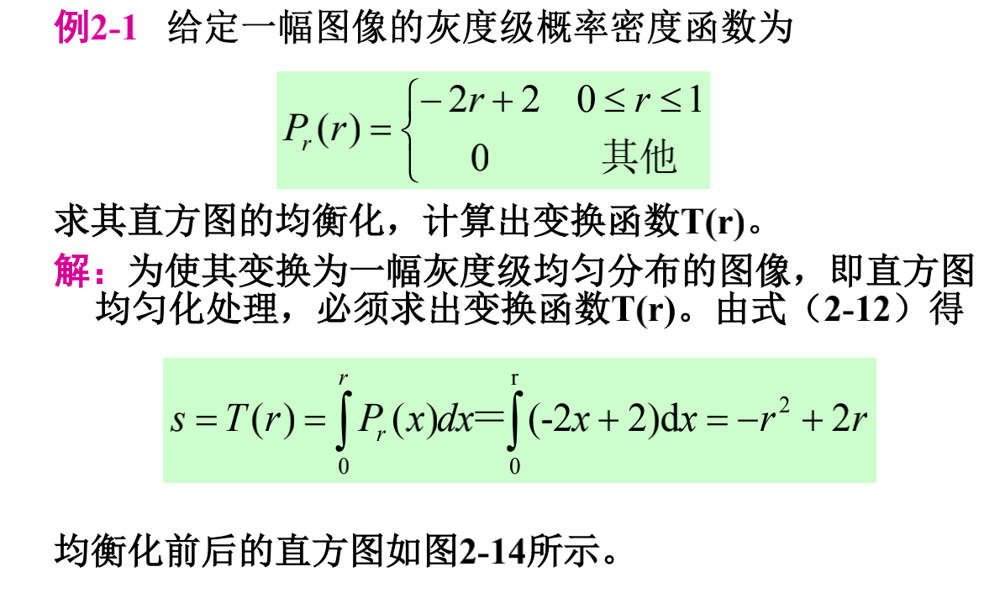
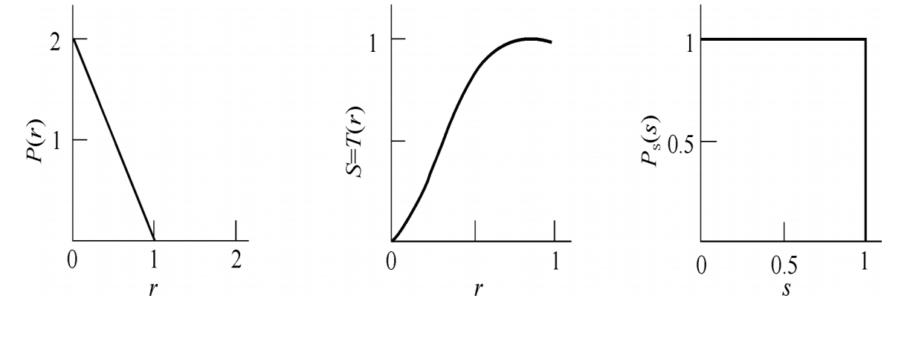
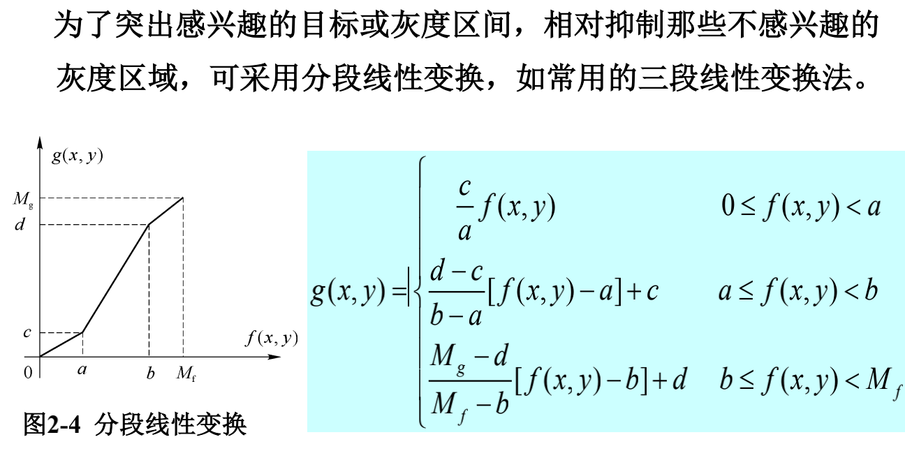
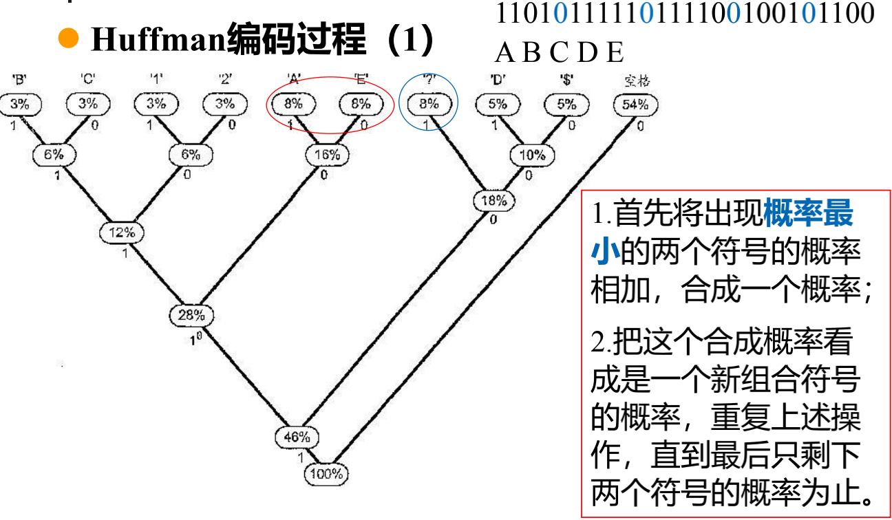

# 数字图像与视频处理

>  学会敏锐的眼光，大部分学的课都是过时的东西，培养方案不是老师想改就可以改的，该上什么就要上什么，很多的知识更新是非常快的

> 现在来讲，卷积神经网络很重要，机器学习，深度学习很重要，但是不能保证十年后还重要，绝对不会白学的。

## 题型

1. 选择10*2
2. 填空10*1
3. 判断10*1
4. 论述10*3
5. 计算10*3

## 论述题

### H.264/AVS视频编码器的原理框图及各模块的作用

a. H.264/AVC P173 6.3.1 图6-6
b. AVS/AVS+  P204 6.5    图6-34

### 最低有效位LSB的原理和主要实现步骤 p256

- 原理：将水印直接嵌入到原始信号表示数据的最不重要
  的位置（最低有效位）中。
- 嵌入水印步骤：
  1. 将原始载体图像的空域像素值由十进制转换到二进
     制表示
  2. 用二进制水印中的每一比特信息替换与之相对应的
     载体数据的最低有效位
  3. 将得到的含水印的二进制数据转换为十进制像素值，
     从而获得含水印的图像
- 提取水印步骤
  1. 将得到的隐藏有水印的十进制像素值转换为二进制
     数据
  2. 将二进制数据的最低有效位提取出来

### 基于DCT域嵌入图像水印方法的大概步骤 p257

- 原理：在图像的频率域中嵌入水印时
- 嵌入水印步骤
  1. 对图像数据进行二维DCT变换
  2. 寻找最大的N个DCT系数X用来携带水印信息
  3. 根据下式得到含水印的DCT系数S
     1. $Si=Xi(1+αWi)$，其中W是水印， α是尺度因子，用于控制水印的嵌入强度
     2. 嵌入强度越大，水印鲁棒性越强，但不可见性越差
  4. 进行二维逆DCT变换，并将像素灰度值进行截
     断使其值位于[0,255]之间，从而得到含水印图像

### 领域平均与中值滤波的原理及特性 p49 p51

#### 领域平均

- **原理**：对含有噪声的原始图像f(x,y)的每一个邻域N，用N中所包含像素的灰度平均值，作为处理后的图像g(x,y)的像素值
- **优点**：算法简单，计算速度快；
- 缺点：在降低噪声的同时容易模糊图像边沿和细节处

#### 中值滤波

**原理（依据）**：噪声以孤立点的形式出现，这些点对应的像素数很少，而图像则是由像素数较多、面积较大的块构成。中值滤波的目的就是要把这些孤立的点去除掉

**方法**：选用一个含有奇数个像素的滑动窗口，将该窗口在图像上扫描，把其中所含的像素点按灰度级的升（或降）序排列，取位于中间的灰度值，来代替窗口中心点的灰度值

**特性**：

- 对某些输入信号中值滤波具有不变
- 去噪声性能

### 图像主观质量评价的优缺点 P274

- 优点：**准确可靠**，因为大多数图像处理系统的最终接收者都是人眼，因此其评价结果常作为基准来判断客观质量评价方法的预测性能。
- 缺点：
  1. 主观评价需要的观察者数目较多，会耗费大量人力和时间，实际操作起来很**不方便且综合成本较大**。
  2. 主观评价有时会受到观察者个人偏好、观察经验、当时情绪等**不确定心理因素**的影响，从而对打分结果产生一定影响。
  3. 主观评价只能做**事后评价**，无法应用于需要对图像与视频质量实时监控的场合。 
  4. 最重要的是，主观评价**无法进行“自动的”质量评价**，更无法作为质量目标来指导图像与视频系统的优化设计。

### 图像质量评价中，均方误差与峰值信噪比的原理、计算公式，主要优缺点P276

#### 均方误差（Mean Squared Error，MSE）

**原理**：基于信号保真度（或误差信号敏感性）的IQA方法，认为失真图像
是由参考图像加上误差信号得到，通过测量误差信号的视觉感知强
度来评价图像失真的程度。

**计算公式**：
$$
MSE=\frac{1}{M\times N}\sum\limits_{i=1}^{M}
\sum\limits_{j=1}^{N}
[f(i,j)-g(i,j)]^2
$$

#### **峰值信噪比（Peak Signal-to-Noise Ratio，PSNR）** 

**定义**为信号最大可能的峰值功率与噪声信号的功率之比，因此可以
看作是对MSE从量纲上的一种转换。

**计算公式**：设L表示灰度图像最大的像素值，对于常见的8比特（bit）量化的
灰度图像，L=28-1=255，则PSNR的计算公式为：(单位为dB)
$$
PSNR=10 \lg(\frac{L^2}{MSE})
$$
**优点**：

1. 具有明确的物理意义，**易于理解**，就是表示所有像素平均意义
   上的误差，即误差信号的能量
2. **计算简单**，只需要极小的计算量，在所有的质量评价算法中是
   最高效的
3. 是**可微分**的，便于数学运算和分析，因此适合作为质量优化的
   指标嵌入到图像处理系统中来指导优化算法的设计

**缺点**：

1. 完全忽视了二维图像信号内部像素之间的空间结构相关性即结构特性，将二维图像信号作为一维信号来处理
2. MSE将误差信号与图像信号完全割裂开来，忽略了图像的局部特征对误差信号可见性的影响，即认为误差信号在不同的图像区域具有相同的视觉重要性。
3. MSE没有反映人眼观察图像的过程，与人眼评价结果的一致性较低。MSE相同的失真图像，其主观质量可能差别很大，反之，主观质量相似的失真图像，MSE可能差别很大。

### 图像质量评价中结构相似性的原理、计算公式和特点P277

原理：(结构相似性测量,Structure Similarity，SSIM)

- 主要基于人眼对图像局部结构信息变化敏感的特性，同时考虑了图像的亮度与对比度变化，结合三方面的相似性测量进行质量预测。
- 根据图像结构的局部化特性，一般是先对图像分块（如8×8块）测量其结构相似性，再对所有块加权平均得到整个图像的SSIM值。

计算公式
$$
SSIM(x,y)=[l(x,y)]^\alpha\cdot [c(x,y)]^\beta \cdot [s(x,y)]^\gamma
$$
SSIM的性质

1. 对称性$SSIM(x,y)=SSIM(y,x)$
2. 有界性$SSIM(x,y)\le 1$
3. 具有唯一的最大值：$SSIM(x,y)=1$，当且仅当x=y

## 计算题

### 腐蚀与膨胀的计算公式、准则以及作用，(P93 )并能通过给定的结构元素对原二值图像分别进行计算

#### 二值图像形态学

- 腐蚀的应用：
  - 去掉小于结构元素的物体
  - 如果两个物体之间有细小的连通，当结构元素足够大时，可以将物体分开

- 膨胀的作用：
  - 连接图像中的邻近目标

|      | 准则                                               | 示意                                             |
| ---- | -------------------------------------------------- | ------------------------------------------------ |
| 腐蚀 | 找出图像A内部可以放下结构元素B的区域               |   |
| 膨胀 | B的反射对这些元素移位操作的结果与A至少重叠一个元素 |  |

### 根据图像的概率分布，画直方图📊，并对其进行均衡化P40

连续灰度级

离散灰度级

### 能够进行分段线性变换，并画出变换关系图形P37 chap2

### 对信源符号进行哈夫曼编码，并计算码字的长度135

### 对信源符号进行算术编码

