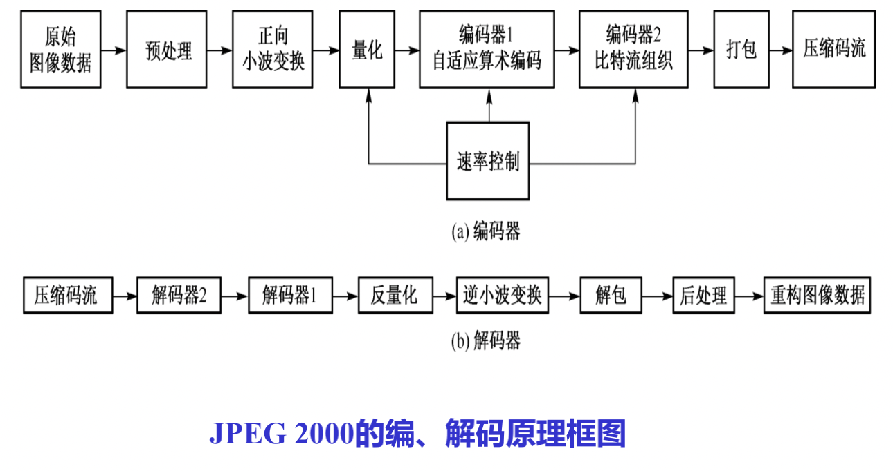

## 小点

### 图像三要素、彩色三要素: P3 chap1

1. lightness亮度
2. Hue色调
3. Saturation饱和度

### 不同颜色空间以及应用的领域: P7 chap1 

1. RGB（红绿蓝）：显示器, 
2. CMY/CMYK（青、品红、黄）：印刷机或者彩色打印机,
3. YUV/YIQ(PAL/NTSC)（亮度、色差）： 彩色电视
4. YCbCr 数字电视
5. HSI/HSV（色调、饱和度、亮度）：从人的视觉系统出发

### 图像压缩编码的方法分类: P132

1. 无失真编码：哈夫曼编码、算术编码、游程编码；
2. 限失真编码：预测编码、变换编码、矢量编码、基于模型的编码。

### 位图与调色板的概念（P219）

1. 位图：是使用像素阵列来描述或映射的图像
2. 调色板：这里的调色板相当于颜色查找表。

### 图像水印的攻击方法（P260）

1. 简单攻击
2. 同步攻击
3. 排除攻击
4. 混淆攻击

### 图像质量评价方法（P271）

1. 主观评价、客观评价
2. 根据不同的准则，客观评价可以有不同的分类方法
3. 基于参考图像的可用性进行分类：全参考图像质量评价、半参考图像质量评价、无参考图像质量评价；
4. 基于失真图像是否包含彩色信息进行分类：灰度图像质量评价、彩色图像质量评价
5. 基于应用范围进行分类： 通用的质量评价、专用的质量评价；

### 视觉纹理特性（P302）

基于对纹理的视觉感知心理学研究，Tamura等人提出了纹理特征的表达方法。 
Tamura纹理特征的6个分量：

1. 粗糙度（coarseness）
2. 对比度（contrast）
3. 方向度（directionality）
4. 线像度（linelikeness）
5. 规整度（regularity）
6. 粗糙度（roughness）

### jpeg2000压缩编码（P163 chap6）

- 开发工作始于1996年1月，其目标是增强对连续色调图像的压缩效率、管理和传输，而又不使图像质量有明显的损失。
- 使用小波变换技术提高压缩比，用户可控制图像的分辨率，用在网络上传输时可按照用户要求下载各种分辨率的图像。
- 可提供无损压缩的图像，在文档中可提供更多的颜色信息。

JPEG2000标准的主要内容：

1. 良好的低比特压缩性能（比JPEG提高10%-30%，适应窄带网络、移
   动通信） 
2. 连续色调图像压缩和二值图像压缩（动态范围：1-16bit）
3. 同时支持无损压缩和有损压缩
4. 渐进传输；
5. 支持感兴趣区编码
6. 良好的抗误码性
7. 向下兼容JPEG

### 梯度算子运算模板（P110 chap4）

1. Roberts算子
2. Prewitt算子：算法简单，检测速度快，但对噪声敏感
3. Sobel算子：

### 彩色电视的制式(P19 chap1)

1. NTSC
2. PAL：CHINA
3. SECAM

### 图像存储大小的压缩比  （这个在哪）

- 熵编码的压缩比较低，可达到的最高压缩比受到信源熵的理论限制，一般为2∶1到5∶1
- 限失真编码方法利用了人类视觉的感知特性，允许压缩过程中损失一部分信息，虽然在解码时不能完全恢复原始数据，但是如果把失真控制在视觉阈值以下或控制在可容忍的限度内，则不影响人们对图像的理解，却换来了高压缩比。在限失真编码中，允许的失真愈大，则可达到的压缩比愈高。

### 游程编码的原理（P135 chap5）

游程编码（RLE），也称行程编码或游程（行程）长度编码，其基本思想是将具有相
同数值（例如，像素的灰度值）的、连续出现的信源符号构成的符号序列用其数值及串的长度表示。以图像编码为例，灰度值相同的相邻像素的连续长度（像素数目）称为连续的游程，又称游程长度，简称游程。

### 各种视频编码标准（P165）

1. ITU-T推出的H.26x系列，主要应用于实时视频通信领域
2. ISO/IEC推出的MPEG-x系列，主要应用于音视频存储、数字音视频广播、因特网或无线网上的流媒体
3. 我国推出的AVS和AVS+标准

### 图像失真的类型P270 chap9

1.  图像编码产生的**压缩失真**
2.  图像采集时由于镜头器件缺陷产生的**噪声失真**
3.  图像采集时由于镜头抖动或散焦产生的**模糊失真**
4.  码流在易错信道中传输由于比特误码产生的**传输失真**

### 神经元模型激活函数P322 chap

1. Sigmoid$f(x)=\frac{1}{1+e^{-x}}$
   1. 梯度消失
   2. 不以零为中心
   3. 计算成本高昂
2. Tanh: $f(x)=\frac{e^x-e^{-x}}{e^x+e^{-x}}$
   1. 以零为中心
   2. 也存在梯度消失
3. ReLU: $f(x)=max(0,x)$
   1. 网络更加收敛
   2. x>0不会饱和，对抗梯度消失
   3. x<0 存在梯度消失
   4. 不以零为中心

